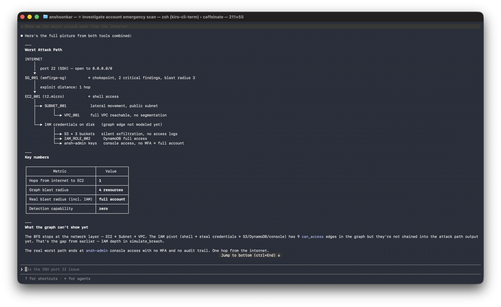

# Emfirge

> AWS security that lives inside your AI. Attack paths, blast radius,
> fix simulations — all from a conversation.

MCP-native · Claude · Cursor · Kiro · Cline · Continue · Codex CLI · Privacy-first

[](LICENSE)
[](https://www.npmjs.com/package/@emfirge/mcp)
[](https://github.com/theanshsonkar/emfirge/actions/workflows/ci.yml)
[](https://github.com/theanshsonkar/emfirge)



<sub><i>"Show me the worst attack path from the internet" — `emfirge_simulate_breach` in Claude Code. AWS IDs are tokenized locally (strict mode) before they reach the LLM.</i></sub>

---

```
You:    scan my AWS, role arn:aws:iam::123456789012:role/EmfirgeReadOnly
Claude: Scanned 47 resources. Risk score: 38/100 (HIGH).
        3 critical findings, 2 toxic combos.
        Worst path: INTERNET → SG_001 → EC2_001 → S3_001 (crown jewel).
        Want me to walk the full kill chain?

You:    verify a fix — close port 22 on that security group
Claude: Simulated. Score jumps 38 → 62. Resolves 2 findings, breaks 0 paths.
        Safe to apply.
```

> **The AI isn't guessing.** Emfirge clones your infrastructure graph, applies
> the change, and re-runs 58 deterministic rules. Claude reads back what the
> engine proved — not what it imagined.

---

## Try it (30 seconds)

```bash
npx @emfirge/mcp install
```

Auto-detects every supported MCP client, wires Emfirge in, picks a privacy
mode. Restart your client, then ask:

> *"Scan my AWS account, role `arn:aws:iam::123456789012:role/EmfirgeReadOnly`,
> region us-east-1"*

**No AWS account? Use the demo ARN — zero setup:**

```
arn:aws:iam::194722410583:role/EmfirgeReadOnly
region: us-east-1
```

> *"Scan with `arn:aws:iam::194722410583:role/EmfirgeReadOnly` in `us-east-1`"*

No role yet but want to scan your real AWS? Say **"help me set up Emfirge"** —
your assistant hands you a one-click CloudFormation deploy link.

**Free.** 15 scans/day per AWS account. No signup. No API keys.

> Need a visual graph? **[emfirge.cloud](https://emfirge.cloud)** — same engine,
> browser UI, free during beta.

### CLI reference

```bash
npx @emfirge/mcp install                # auto-wire to all detected MCP clients
npx @emfirge/mcp uninstall              # remove from all clients
npx @emfirge/mcp status                 # show what's wired up + privacy mode
npx @emfirge/mcp privacy <mode>         # strict | balanced | off
npx @emfirge/mcp tokens                 # list local token mappings
npx @emfirge/mcp purge --role-arn <ARN> # delete all your scan data
```

Env vars, per-client config paths, manual install fallback → [`mcp/README.md`](mcp/README.md).

---

## What you get

- **Attack paths** from the internet to your S3 / RDS / IAM crown jewels,
  ranked by exploit difficulty (weighted Dijkstra, not hop count)
- **58 graph-aware rules** with context-aware severity — SSH-open behind an
  ALB drops Critical → Low; public S3 with CloudFront drops Critical → Low
- **Toxic-combo detection** — dangerous pattern pairs like *public RDS + no
  CloudTrail*, *SSH-open + GuardDuty disabled*
- **Deterministic fix simulation** — clone infra → apply mutation → rebuild
  graph → rerun every rule → diff. No LLM in the verification path. A real proof.
- **Compliance mapping** — CIS AWS Foundations 1.5 + SOC 2, per-control pass/fail
- **MITRE ATT&CK** technique mapped to every finding

Coverage: EC2, Lambda, ECS, S3, EBS, RDS, IAM, Secrets Manager, KMS, VPC,
Security Groups, WAF, CloudFront, SNS, CloudTrail, GuardDuty, CloudWatch,
AWS Config, Budgets — 16 services, 58 rules.

---

## Privacy in one paragraph

In the default `strict` mode, the MCP **tokenizes every AWS identifier
locally** before any data reaches your LLM. The mapping lives at
`~/.emfirge/tokens.json` — never sent to Emfirge, Anthropic, or anyone.

```
What the LLM sees:    "INTERNET → SG_001 → EC2_001 → S3_001"
What's on your disk:  SG_001 = sg-0a1b2c3d
                      EC2_001 = i-0abc...
                      S3_001 = acme-prod-data
```

Three modes, switch any time:

| Mode | What's tokenized | Best for |
|---|---|---|
| `strict` *(default)* | Every AWS ID — ARNs, EC2/SG/IAM/S3, IPs, account IDs, bucket names | Banks, healthcare, regulated industries |
| `balanced` | ARNs, EC2/SG/EIP/IAM IDs, IPs, account IDs. Subnets/VPCs/volumes raw. | Most users |
| `off` | Nothing — raw IDs go to the LLM | Personal accounts, demo, debugging |

```bash
npx @emfirge/mcp privacy strict|balanced|off
```

Backend retention is 90 days. Run `npx @emfirge/mcp purge --role-arn <ARN>`
to wipe everything, instantly. Full story in [PRIVACY.md](PRIVACY.md).

---

## How the data flows

```
┌──────────────┐   role ARN    ┌──────────────┐  read-only   ┌─────┐
│ Your laptop  │──────────────▶│ emfirge.cloud│─────────────▶│ AWS │
│ (MCP host)   │               │   (scanner)  │  STS, 1 hr   └─────┘
└──────┬───────┘               └──────┬───────┘
       │                              │
       │ tokenized IDs                │ findings + graph
       ▼                              ▼
┌──────────────┐               ┌──────────────┐
│  Your LLM    │               │ Postgres + S3│
│ (Claude/etc) │               │  (90-day TTL)│
└──────────────┘               └──────────────┘
```

The MCP runs on **your laptop**. Your LLM only ever sees tokenized IDs —
the mapping never leaves your machine. The backend assumes your read-only
IAM role with a 1-hour STS token, scans, saves findings for 90 days, then
auto-deletes.

---

## Under the hood

- **Weighted Dijkstra attack paths** — edges weighted by exploit difficulty
  (0 = metadata, 1 = trivial network reach, 5 = very hard). A 5-hop trivial
  path ranks more dangerous than a 2-hop credential theft.
- **Brandes' betweenness centrality** — finds chokepoint nodes where
  hardening one resource eliminates the most attack paths at once.
- **Deterministic fix simulator** — graph mutation + rule re-run, no LLM
  in the verification path. Proof, not a guess.
- **Privacy-first MCP tokenization** — three configurable modes, all
  redaction happens before any byte reaches the LLM transport.

---

## MCP tools exposed

| Tool | What it does |
|---|---|
| `emfirge_setup_help` | Returns the CloudFormation deploy URL |
| `emfirge_scan` | Run a scan, returns score + `analysis_id` |
| `emfirge_get_findings` | Pull findings, filterable by severity |
| `emfirge_attack_paths` | Internet → crown-jewel paths + chokepoints |
| `emfirge_verify_fix` | Simulate a fix, see real score delta |
| `emfirge_check_compliance` | CIS / SOC 2 per-control status |
| `emfirge_simulate_breach` | Full kill-chain walkthrough — attack stages, blast radius, follow-up moves |

> All 7 tools are deterministic on the backend — no LLM calls inside the MCP
> path. Your host LLM is the only AI in the loop, and in `strict` mode it only
> ever sees tokenized data.

---

## Security model

- Read-only IAM role — **zero write permissions**
- ExternalId — prevents confused-deputy attacks
- Scoped trust — only Emfirge's AWS account can assume the role
- STS temporary credentials — expire in 1 hour, never stored
- Instant revoke — delete the CloudFormation stack, all access is gone

[Full security details →](https://emfirge.cloud/security.html)

---

## License

[BUSL 1.1](LICENSE) — free for any non-production use, free in production
up to $1M ARR or 100 employees. Auto-converts to Apache 2.0 in 2030.
Contributors agree to the same terms — see [CONTRIBUTING.md](CONTRIBUTING.md).

---

## Author

Built by Ansh Sonkar — [LinkedIn](https://linkedin.com/in/theanshsonkar) ·
[emfirge.cloud](https://emfirge.cloud)
